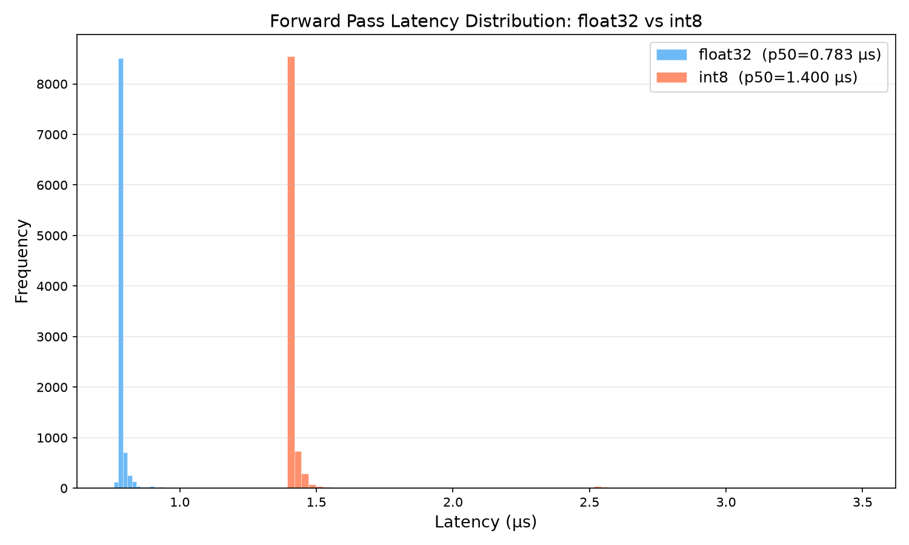
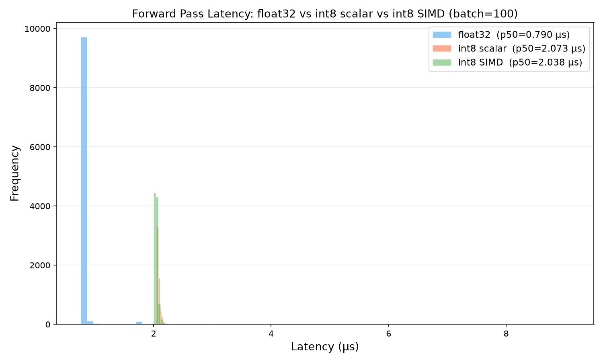

# Bare-Metal Inference Engine

A C++ neural network inference engine built from scratch — no frameworks, no dependencies, no libraries. Just raw matrix operations, manual memory management, int8 quantization, and AVX2 SIMD acceleration.

**Machine:** Intel i5-13th Gen | **Compiler:** g++ `-O3 -march=native -mavx2`

---

## Project Structure

```
├── src/                            Month 1 — float32 foundations
│   ├── tensor.hpp / tensor.cpp       Tensor struct + matmul()
│   ├── Layer.hpp                     Fully connected layer
│   ├── relu.hpp                      ReLU activation
│   ├── main.cpp                      Week 1: matmul baseline
│   ├── mainv2.cpp                    Week 2: 3-layer forward pass
│   └── inference.cpp                 Week 4: binary weight loader
│
├── v1_float32/                     Month 2 — float32 baseline
│   └── main.cpp                       Self-contained float32 inference
│
├── v2_int8/                        Month 2 — int8 quantized engine
│   ├── main.cpp                       Self-contained int8 inference
│   └── weights_int8.bin               Quantized weights (int8 + scale)
│
├── v3_simd/                        Month 2 — AVX2 SIMD int8 engine
│   ├── int8_simd.hpp                  Scalar + SIMD matmul implementations
│   ├── main.cpp                       Standalone SIMD inference
│   ├── validate.cpp                   Correctness validation (10 inputs)
│   └── bench_simd.cpp                 Triple cross-check benchmark
│
├── v4_cuda/                        Month 2 — Naive CUDA GPU engine
│   └── cuda_inference.cu              Naive CUDA inference code
│
├── benchmarks/
│   ├── bench.cpp                      128×128 matmul latency
│   ├── bench_both.cpp                 Month 2: float32 vs int8 benchmark
│   ├── bench_simd.cpp                 Month 2: scalar vs SIMD benchmark
│   ├── cache_experiment.cpp           Cache line experiment
│   ├── alignment_demo.cpp             Memory alignment check
│   ├── latency_results.csv            Month 2 raw data (10K samples)
│   ├── latency_results_v3.csv         Month 2 raw SIMD data (10K samples)
│   ├── latency_histogram.png          Month 2 latency chart
│   └── latency_histogram_v2.png       Month 2 3-way latency chart
│
├── scripts/
│   ├── generate_weights.py            Weight generator (numpy, seed=42)
│   ├── golden.py                      Golden reference output
│   ├── quantize_weights.py            int8 quantization script
│   ├── plot_histogram.py              Month 2 histogram plotter
│   └── plot_histogram_v3.py           Month 2 3-way histogram plotter
│
├── weights.bin                      Pretrained weights (binary)
├── golden_output.txt                Reference output for validation
└── Makefile
```

---

## Build & Run

```bash
make all            # Build all targets
make weights        # Regenerate weights.bin
make debug          # Build with -O0 for debugging
make clean          # Remove binaries

# Month 1
./engine            # Week 1: matmul baseline
./enginev2          # Week 2: 3-layer forward pass
./inference weights.bin  # Week 4: inference with weights

# Month 2
./float32_v1        # Float32 baseline
./int8              # Int8 quantized inference
./bench_int8        # Float32 vs int8 benchmark (10K samples)
./v3_validate       # SIMD correctness validation
./v3_bench          # Scalar vs SIMD vs float32 benchmark
nvcc -O2 -arch=sm_75 v4_cuda/cuda_inference.cu -o cuda_inference
./cuda_inference /kaggle/input/datasets/kingshiva8989/bare-metal-weights/weights_int8.bin
```

---

## Month 1 Progress

| Week | Focus | Deliverable |
|------|-------|-------------|
| **Week 1** | C++ foundations | `Tensor` struct, `matmul()`, chrono benchmarking |
| **Week 2** | Neural net forward pass | `Layer` struct, 3-layer ReLU network, end-to-end timing |
| **Week 3** | Memory & cache model | Cache line experiment, alignment demo |
| **Week 4** | Binary I/O | Python weight generator, `./inference`, golden validation |

### Month 1 Benchmarks

| Metric | Value |
|--------|-------|
| 128×128 matmul (p50) | 274 µs |
| 3-layer forward pass (p50) | ~1 µs |
| Sequential memory (1M floats) | 733 µs |
| Strided memory (every 16th) | 5502 µs |
| Cache penalty | 7.5× |
| Output error vs golden | 4.46e-07 |

> *Note: The Month 1 forward pass latency of ~1 µs was measured using a less rigorous single-chrono-call method, which was later superseded by Month 2's more precise batch timing and cross-check approach (showing ~0.8 µs).*

---

## Month 2 Progress

| Week | Focus | Deliverable |
|------|-------|-------------|
| **Week 5** | int8 quantization | `quantize_weights.py`, `weights_int8.bin`, scale-factor check |
| **Week 6** | int8 forward pass + benchmarking | `v2_int8/` inference, 10K-sample p50/p95/p99, latency histogram |
| **Week 7** | AVX2 SIMD int8 matmul | `v3_simd/` engine, 10-input validation, triple cross-check benchmark, 3-way histogram |
| **Week 8** | CUDA GPU Kernel | `v4_cuda/` naive CUDA implementation, custom block reduction quantization kernel, correctness validation |

## Month 2 Benchmarks

> C++ and SIMD CPU benchmarks were evaluated on an Intel i5-13th Gen CPU (`-O3 -march=native -mavx2`). CUDA GPU benchmarks were evaluated on an NVIDIA T4 GPU with a CPU host.

### 1. Float32 Baseline vs. Int8 Quantization (Weeks 5 & 6)

**Latency (batch=100 average, 10K samples):**

| Metric | float32 | int8 | Speedup |
|--------|---------|------|---------|
| p50 | 0.777 µs | 1.413 µs | 0.6× |
| p95 | 0.829 µs | 1.485 µs | 0.6× |
| p99 | 0.949 µs | 1.877 µs | 0.5× |

**Latency (batch=1 single-call, 1K samples):**

| Metric | float32 | int8 | Speedup |
|--------|---------|------|---------|
| p50 | 0.801 µs | 1.411 µs | 0.6× |
| p95 | 1.129 µs | 1.438 µs | 0.8× |
| p99 | 1.271 µs | 1.903 µs | 0.7× |

> batch=100: each sample times 100 consecutive calls, divides by 100. batch=1: single call per sample. Timer resolution: 78 distinct float32 values, 67 distinct int8 values — adequate for ~1 µs timescale.

**Accuracy (1000 random inputs, seed=12345, N(0,1)):**

| Metric | Value |
|--------|-------|
| Max abs error (int8 vs float32 output) | 2.41e-03 |
| Mean abs error | 1.68e-04 |
| Max weight quantization error | 8.64e-04 |
| Argmax match rate | 981/1000 (98%) |

> int8 is ~1.8× slower than float32 at this model size. Dynamic per-layer re-quantization overhead dominates the tiny ~10K MAC computation. Speedups require larger matrices or static quantization.



---

### 2. AVX2 SIMD Acceleration (Week 7)

**Latency (batch=100 average, 10K samples):**

| Metric | float32 | int8 scalar | int8 SIMD (AVX2) | SIMD vs scalar |
|--------|---------|-------------|-------------------|----------------|
| p50 | 0.795 µs | 2.071 µs | 2.045 µs | 1.01× |
| p95 | 0.862 µs | 2.261 µs | 2.606 µs | 0.9× |
| p99 | 2.069 µs | 3.858 µs | 2.982 µs | 1.3× |

**Latency (batch=1 single-call, 1K samples):**

| Metric | int8 scalar | int8 SIMD (AVX2) | SIMD vs scalar |
|--------|-------------|-------------------|----------------|
| p50 | 2.071 µs | 2.052 µs | 1.01× |
| p95 | 2.903 µs | 2.088 µs | 1.4× |
| p99 | 2.974 µs | 2.124 µs | 1.4× |

> batch=100: each sample times 100 consecutive calls, divides by 100. batch=1: single call per sample. Timer resolution: 157 distinct scalar values, 115 distinct SIMD values — sufficient for meaningful measurements.

> Cross-check: batch=100 p50 / batch=1 p50 ratios: scalar = 1.00×, SIMD = 1.00× — both within 0.7×–1.5×, confirming batch averaging is not hiding anomalies.

**Correctness (SIMD vs scalar int8, 10 random inputs, seed=12345):**

| Metric | Value |
|--------|-------|
| Max abs error (SIMD vs scalar) | 0.0 |
| Mean abs error (SIMD vs scalar) | 0.0 |
| Argmax match rate | 10/10 (100%) |

> SIMD output matches scalar exactly. The widening approach (`cvtepi8_epi16` → `mullo_epi16` → `cvtepi16_epi32`) produces identical int32 accumulators to the scalar loop. SIMD changes speed, not math.

**Speedup assessment:** SIMD provides no meaningful speedup at this model size (1.01×). The network is tiny (max 128×64 matmul). The overhead of loading data into SIMD registers, widening int8→int16→int32, and storing results back dominates the actual arithmetic savings. SIMD speedups require larger matrix dimensions to amortize register load/store overhead.



---

### 3. CUDA GPU Inference (Week 8)

**Latency (batch=1, 1000 samples):**

| Configuration | Latency Component | p50 | p95 | p99 |
|---------------|-------------------|-----|-----|-----|
| **GPU Naive CUDA** | Memcpy (H2D + D2H) | 25.70 µs | 28.16 µs | 36.67 µs |
| | Kernel Compute | 48.45 µs | 49.15 µs | 56.06 µs |
| | Combined (Total) | 74.11 µs | 78.27 µs | 88.10 µs |
| **CPU Int8 Reference** | Full Forward Pass | 8.28 µs | 9.45 µs | 14.02 µs |

**Correctness (GPU vs CPU Int8 Reference, 100 random normal inputs):**

| Metric | Value |
|--------|-------|
| Max absolute error | 0.000000e+00 |
| Mean absolute error | 0.000000e+00 |

> **Analysis & Tradeoffs:**
> 1. **Kernel Launch Overhead:** The naive GPU compute latency (48.45 µs) is significantly higher than the CPU reference (8.28 µs) for batch size 1. This is a classic launch-bound constraint: dispatching 9 sequential kernels (quantize, matmul, activation per layer) introduces driver and context queue serialization overhead of ~4–5 µs per call.
> 2. **Transfer Penalty:** Copying the activation input and output over the PCIe lanes adds a fixed ~25 µs cost, cementing the CPU as the lower-latency option at batch size 1.

---

## Roadmap

- [x] **Month 1** — C++ foundations, forward pass, binary weights ✅
- [x] **Month 2** — int8 quantization, AVX2 SIMD, CUDA GPU kernel ✅
- [ ] **Month 3+** — Shared memory tiling, loop unrolling, KV caching, Transformer Layer

## License

MIT
